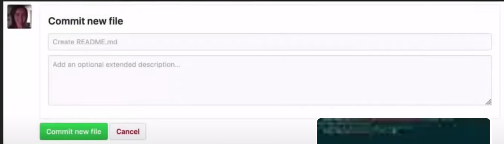
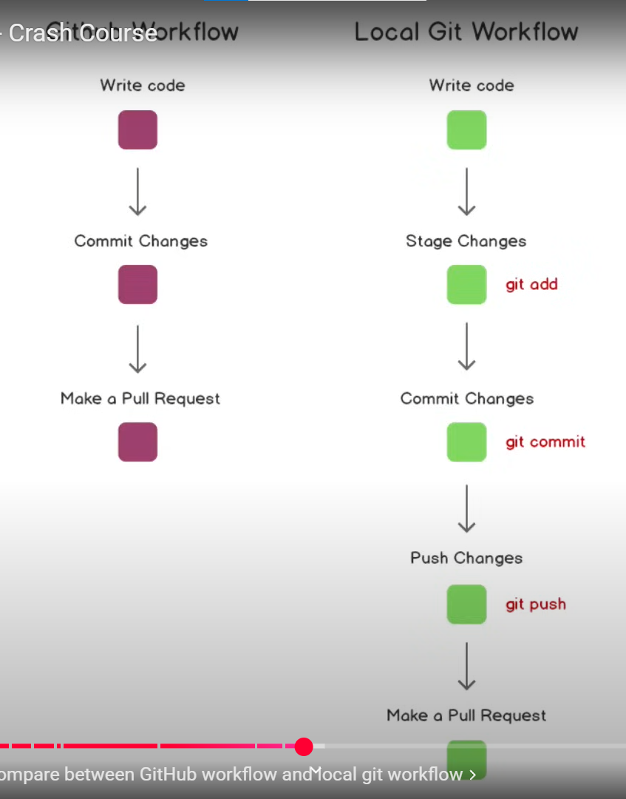

## Git commands

ls -la (to show all the files) 
git status 
git add .        # to track all the files in the folder 
git add folder_name 
git commit -m "update readme.md" -m "added the main git commands" 

##ssh key generate to connect github with local machine  
 ssh-keygen -t rsa -b 4096 -C "email@gmail.com"  
 $ ls| grep "key_name" 
 $ cat ~/.ssh/id_ed25519.pub | clip Copies the contents of the id_ed25519.pub file to your clipboard  
 resource link [key generate](https://docs.github.com/en/authentication/connecting-to-github-with-ssh/checking-for-existing-ssh-keys) 
 eval "$(ssh-agent -s)" 

## git push  
git push origin master //made locally then pushed to the repo  
git inint //initialized empty repo  
git remote add origin ssh for the created repo  
git remote -v //shows local and remote repos connceted  
git push -u origin master //creating repo locally  
## github workflow
  
## git test check  
git commit -am "msg" //works only for modified files, not newly created files  
git checkout test  
